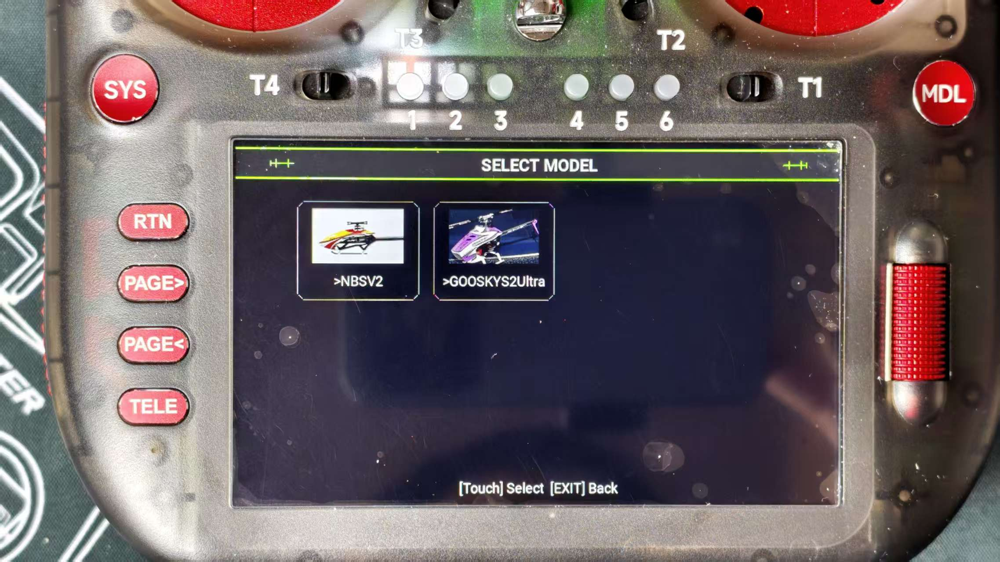
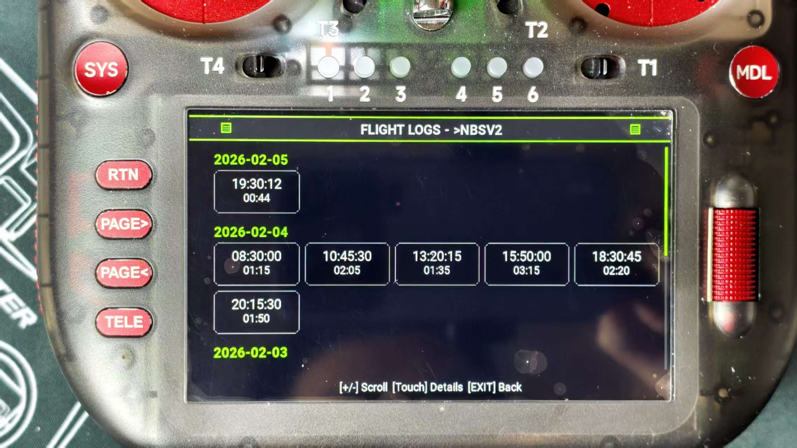
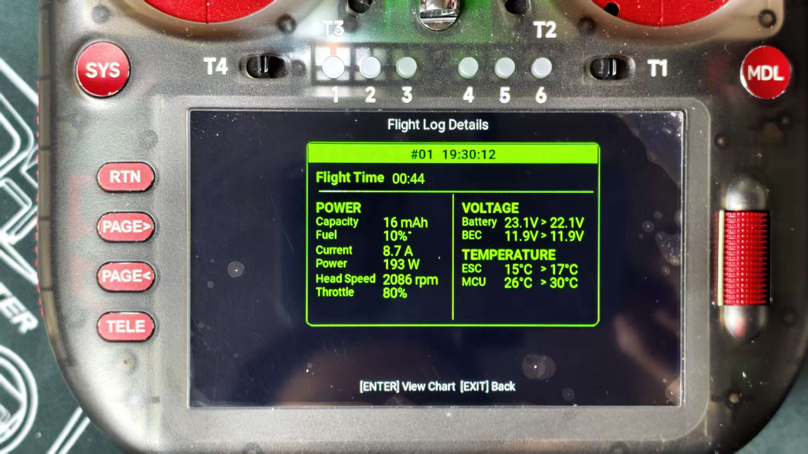
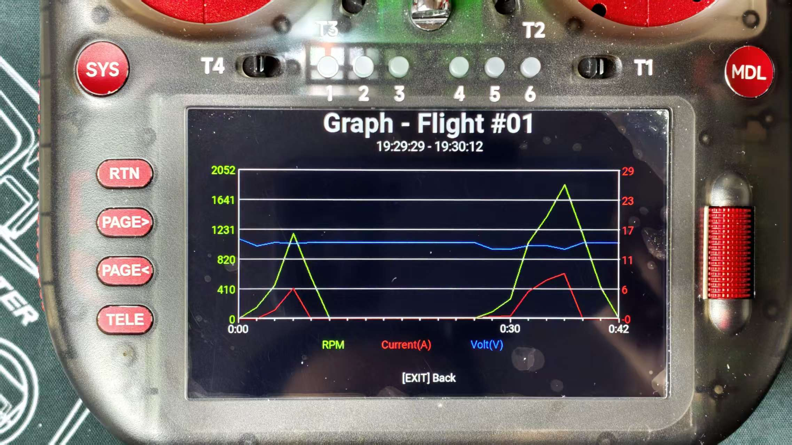

  

# Rotorflight  Telemetry Widget for RadioMaster TX16 MK3

A comprehensive telemetry display widget designed specifically for the Rotorflight  helicopter when used with the RadioMaster TX16 MK3 transmitter.

## State

  It is currently under testing and will be available to everyone soon.

## Overview

This Lua script provides real-time telemetry monitoring for your Rotorflight , displaying critical flight parameters in an easy-to-read format optimized for the TX16 MK3 screen. Simply copy to your SD card and activate in App Mode.

## Features

- **Helicopter-Specific Layout**: Tailored display for RadioMaster Nexus-X/XR parameters
- **Real-Time Telemetry**: Live updates of voltage, RPM, temperature, and signal
- **App Mode Optimization**: Full-screen display without transmitter UI clutter
- **Low Battery Alerts**: Visual and audio warnings (configurable thresholds)
- **RSS Signal Monitoring**: Signal strength bar with loss counter
- **Flight Timer Integration**: Automatic timer start/stop based on throttle
- **Flight log recording function**: displaying rotational speed, battery consumption, and performance rate curve function, for better analysis of battery performance parameters.
- **Vibration analysis**: provides real-time feedback on vibration information, assisting you in diagnosing the vibration sources of the machine.
- **flight parameters**:The setting of flight parameters does not require entering the RF adjustment script interface. It can be directly set within this script interface.

<table>
  <tr>
    <td width="320"></td>
    <td width="320"></td>
  </tr>
  <tr>
    <td width="320"></td>
    <td width="320"></td>
  </tr>
   
</table>
 

  

 